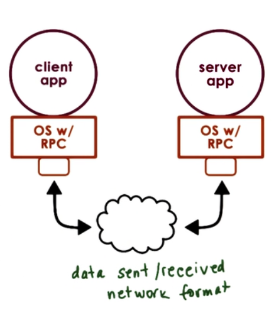

# Remote Procedure Calls

Example : GetFile App

- Client Server
- Create and init sockets
- Allocate and populate buffers
- Include 'protocol' info
	- GetFile, size
- Copy data into buffers
	- filename, file
* common steps related to remote IPC 

#### Remote Procedure Calls (RPC)

* Intended to simplify the development of cross address space and cross machine interactions

**\+** Higher-level interface for data movement and communication 
**\+** Error handling 
**\+** Hiding complexities of cross machine interactions

## RPC requirements

1. Client/Server interactions
2. Procedure Call Interface => RPC
	- sync call semantics
3. Type checking 
	- error handling 
    - packet bytes interpretation
4. Cross machine conversion
	- e.g. big/little endian
5. Higher level protocol
	- access control, fault tolerance, different transport protocols
    
## Structure of RPC

## RPC Steps:

(-1.) register : server registers procedure, arg types, location 
(0.) bind : client finds and binds to desired server

1. call : client make RPC call; control passed to stub, client code blocks
2. marshal : client stub "marshals" args (serialize args into buffer)
3. send : client sends message to server
4. receive : server receives message; passes message to server stub; access control
5. unmarshal : server stub "unmarshals" args (extract args from buffer)
6. actual call : server stub calls local procedure implementation
7. result : server performs operation and computes result of RPC operation

(same on return <=)

## Interface definition Language (IDL)

* Used to describe the interface the server expects
	- procedure name, args, 2 result types
    - version number

RPC can use IDL that is 

1. Language agnostic
	- XDR in SunRPC
2. Language specific
	- Java in JavaRMI
    
## Marshalling

## Unmarshalling

Marshalling/Unmarshalling routines are provided by RPC system compiler.

## Binding and Registry

* Client determines
	- **which** server to connect to?
    	- service name. version number
	- **how** to connect to that server?
    	- IP address, network protocol
* Registry : database of available services
	- search for service name to find server(which) and contact details(how)
    - distributed 
    	- any RPC service can register
    - machine-specific
    	- for services running on same machine
        - clients must know machine addresses
        - registry provides port number needed for connection
* Who can provide a service?
	- lookup registry for image processing
* What services do they provide?
	- compress/filter.. version number => IDL
* How will they ship package?     
	- TCP / UDP -> registry
    
## Pointers

* Procedure interface : foo(int,int)
* in Local Calls : foo(x,y) => okay
* in Remote Calls : foo(x,y) => ?

here, y points to location in caller address space 

* Solutions:
	- No pointers
    - Serialize pointers; copy referenced ("points to") data structure to send buffer
    
## Handling Partial Failures 

- Special RPC error notification (signal, exception..)
	- Catch all possible ways in which RPC can (partially) fail
    
## RPC Design choice

* Binding => How to find the server
* IDL => How to talk to server; how to package data
* Pointers as args => Disallow or serialize pointer data
* Partial failures => Special error notifications

