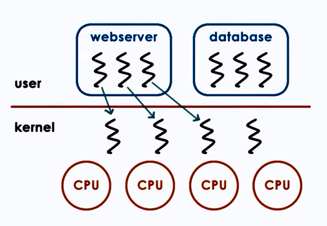
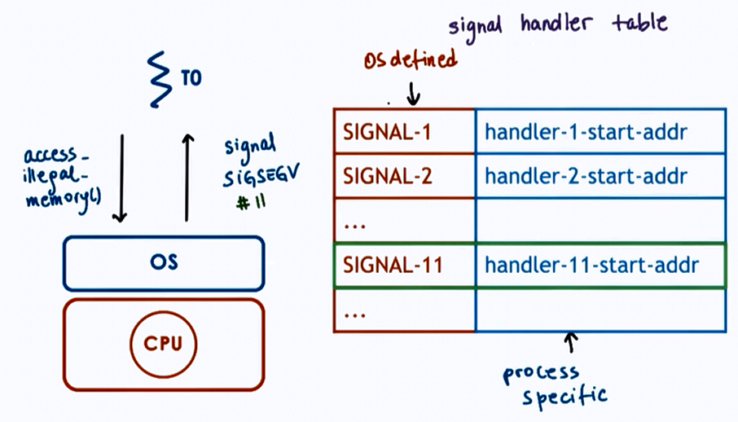
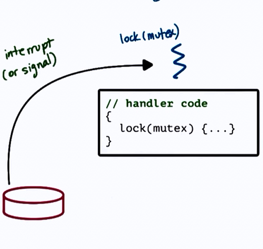
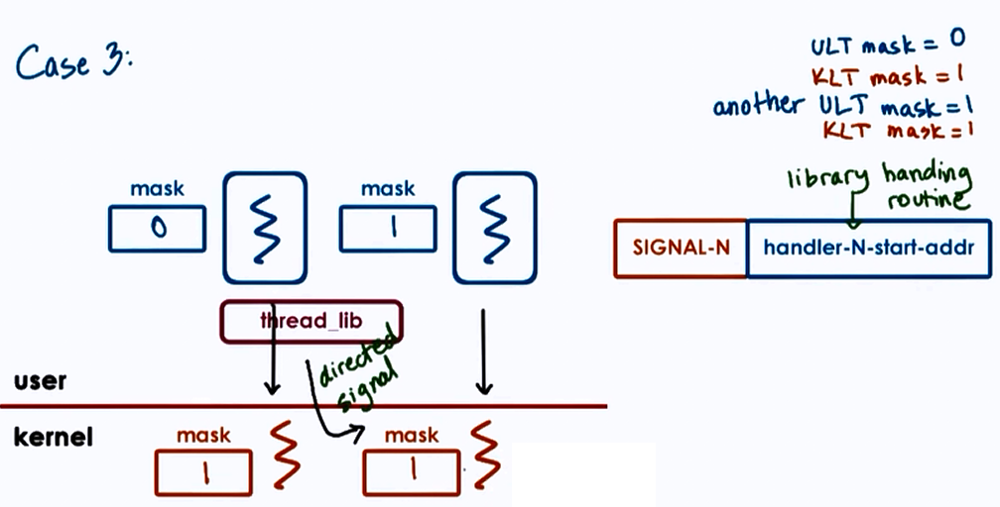
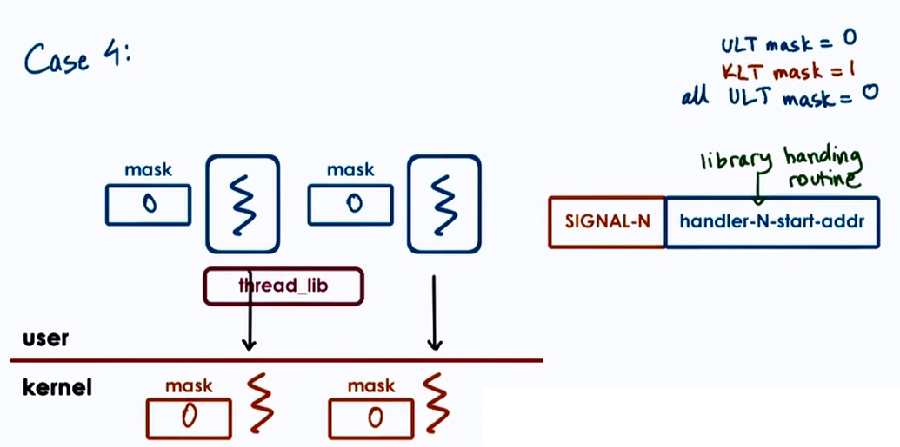
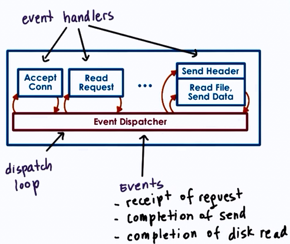
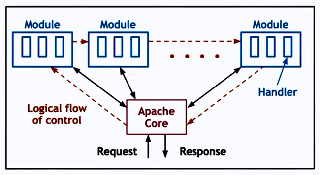

# Threads and Concurrency

**Thread**:

- is an active
	- entity executing unit of a process
- works simultaneously with others
	- many threads execute together
- requires coordination
	- sharing of I/O devices, CPUs, memory
    
## Process vs Thread 


## Why are threads useful?

* Parallelization => Speedup
* Specialization => Hot cache
* Efficiency => lower memory requirement & cheaper IPC
* Time for context switch in threads is less, since memory is shared, hence mapping is not required between virtual and physical memory.
	- Therefore multithreading can be used to hide latency.
* Benefits to both applicatioons and OS code 
	- Multithreaded OS kernel
		- threads working on behalf of applications
        - OS level services like daemons and drivers

## What do we need to support threads?

* Threads data structure
	- Identify threads, keep track of resource usage..
* Mechanisms to create and manage threads
* Mechanisms to safely coordinate among threads running concurrently in the same address space

## Concurrency control and Coordination

- Mutual exclusion 
	- Exclusive access to only one thread at a time
    - **mutex**
- Waiting on other threads
	- Specific condition before proceeding
    - **condition variable**
- Waking up other threads from wait state

## Threads and Threads creation 

- Thread data structure: 
	- Thread type, Thread ID, PC, SP, registers, stack, attributes.

- **Fork**(proc, args)
	- create a thread
    - not UNIX fork 
    
```
t1 = fork(proc, args)   
```

- **Join**(thread)
	- terminate a thread

```
child_result = join(t1)   
```

### Example:

```
Thread  t1;
Shared_List list;
t1 = fork(safe_insert, 4);
safe_insert(6);
join(t1); //Optional
```

The list can be accessed by reading shared variable.

## Mutual Exclusion

- Mutex data structure:
	- locked?, owner, blocked_threads
    
```
lock(mutex){
	//Critical Section
    //Only one thread can access at a time
}
unlock(mutex)
```


## Producer Consumer problem

What if the processing you wish to perform with mutual exclusion needs to occur under certai conditions?

For e.g. The producer appends items to a list until the list is full, and the consumer has to print out all the items of the list once the list if full and then empty the list. Thus we have to execute the Consumer thread only under a certain condition (here- when the list becomes empty, print items).

Solution: Use **Condition Variables**

- Wait(mutex, condition)
	- mutex is automatically released and reaquired on wait
    - The consumer applies _Wait_ until the list is full
    
- Signal(condition)    
	- Notify only one thread waiting on condition
    - The Producer applies _Signal_ to the Consumer thread when the list is full
- Broadcast(condition)    
	- Notify all waiting threads
    
    

## Readers / Writer problem

* 0 or more readers can access a resource
* 0 or 1 writer can write the resource concurrently at the same time

- One solution:
	- lock on resource
    	- good for writer
    	- too restrictive for readers
        
- Better solution:

```
if ((read_count == 0) & (read_count == 0))
	R okay, W okay
if (read_count > 0)
	R okay    
if (read_count == 1)
	R not-okay, W not-okay    
```

State of shared resource:

* free : resource_counter = 0
* reading : resource_counter > 0
* writing : resource_counter = -1

Thus essentially we can apply mutex on the new proxy 'resource_counter' variable that represents the state of the shared resource.

## Avoiding common mistakes

- keep track of mutex/lock variable used with a resource
	- e.g. mutex_type m1; // mutex for file1
- check that you are always and correctly using lock and unlock 	- Compilers can be used as they generate errors/warnings to correct this type of mistake  	
- Use a single mutex to access a single resource
- check that you are signalling correct condition
- check that you are not using signal when broadcast is needed
	- signal : only 1 thread is will proceed, remaining threads will wait
- check thread execution order to be controlled by signals to condition variables

## Spurious(Unnecessary) Wake ups

When we wake up threads knowing they may not be able to proceed.

## Deadlocks

Two or more competing threads are said to be in a deadlock if they are waiting on each other to complete, but none of them ever do.


Here T1 and T2 are in deadlock.

### How to avoid this?

1. Unlock T1 before locking T2
	- Fine-grained locking but T1 nad T2 may both be required
2. Use one mega lock, get all locks upfront, then release at end
	- For some applications this may be ok. But generally its too restrictive and limits parallelism
3. Maintain lock order
	- first m_T1
    - then m_T2 
    	- this will prevent cycles in wait graph

A cycle in wait graph is necessary and sufficient for deadlock to occur.<br> 
(thread-waiting-on-resource ---edge---> thread-owning-resource)

* Deadlock prevention => Expensive<br>
Pre-check for cycles and then delay process or change code

* Deadlock Detection and Recovery => Rollback

## Kernel vs User level Threads


Three types of models:

#### 1. **One to One model**:



**Advantages**: 

* OS sees threads
* Synchronization
* Blocking

**Disadvantages**: 

* Must go to OS for all operations
* OS may have limits on policies, threads
* Portability

#### 2. **Many to One model**:


**Advantages**: 

* Totally Portable 
* Doesn't depend on OS limits and policies

**Disadvantages**: 

* OS may block entire process if one user-level thread blocks on I/O

#### 3. **Many to Many model**:


**Advantages**: 

* Best of both worlds
* Can have bound or unbound threads

**Disadvantages**: 

* Requires coordination between user and kernel level thread managers

## Multithreading patterns

**1. Boss-Workers pattern**

* Boss- assigns work
* Workers- perform entire task

Throughput of system is limited by boss thread. Hence boss thread must be kept efficient.

Throughput = 1/boss-time-orders

Boss assigns works by:
1. Directly signalling specific works
	- **\+** workers don't need to sync
    - **\-** boss must keep track of everyone
2. Placing work in queue
	- **\+** boss doesn't neeed to know details about workers
    - **\-** queue synchronization

How many workers?
- on demand
- pool of workers
- static vs dynamic (i.e dynamically increasing size according to work)

**Advantages**: 

* Simplicity

**Disadvantages**: 

* Thread pool management
* Locality

**1B. Boss-Workers pattern variant**

* Here workers are specialized for certain tasks opposite to the previous equally created workers

**Advantages**: 
* Better locality
* Quality of Service management

**Disadvantages**: 
* Load balancing

**2. Pipeline pattern**

* Threads assigned one subtask in the system
* Entire task = Pipeline of threads
* Multiple tasks concurrently run in the system, in different pipeline stages
* Throughput depends on weakest link
* Shared buffer based communication between stages

**3. Layered pattern**

* Layers of threads are assigned group of related subtasks
* End to end task must pass up and down through all layers

**Advantages**: 
* Specialization
* Less fine-grained than pipeline

**Disadvantages**: 
* Not suitable for all applications
* Synchronization

### Example:

**Q)** For 6 step toy order application we have 2 solutions:

1. Boss-workers solution
2. Pipeline solution

Both have 6 threads. In the boss-workers solution, a worker produces a toy order in 120 ms. In the pipeline solution, each of 6 stages take 20 ms.

How long will it take for these solutions to complete 10 toy orders and 11 toy orders?

**A)** 6 threads means for Boss-workers, 1 thread is for boss, 5 for workers. In pipeline 6 threads are equally used.

For 10 toy orders:
```
Boss-workers(10) = 120 + 120 = 240 ms
Pipeline(10) = 120 + (9*20) = 300 ms
```
Here Boss-workers is better than Pipeline.

For 11 toy orders:
```
Boss-workers(11) = 120 + 120 + 120 = 360 ms
Pipeline(11) = 120 + (10*20) = 320 ms
```
Here Pipeline is better than Boss-workers.

This proves that choosing a better pattern depends on the number of threads and the work required to be done.

## PThreads

PThreads == POSIX Threads

POSIX = Portable OS interface

### Compiling PThreads

1. #include<pthread.h> in main file
2. Compile source with -lpthread or -pthread
```
gcc -o main main.c -lpthread
gcc -o main main.c -pthread
```
3. Check return values of common examples


### PThread mutexes
- to solve mutual exclusion problems among concurrent threads

### Safety tips

* Shared data should always be accessed through single mutex
* Mutex scope must be visible to all
* Globally order locks
	- for all threads, lock mutexes in order
* Always unlock a mutex (correctly)

## Thread Design Considerations

### Kernel vs User Level Threads


### Thread related data structures


### Hard vs Light Process states

PCB is divided into multiple data structures classified as follows:

- Light Process states
	- Signal mask 
    - System call args
- Heavy Process states 
	- virtual address mapping
    
#### Rationale for Multiple Data Structures:

|Single PCB |Multiple DS|
|-----------|-----------|
|Large continuos DS|Smaller DS|
|Private for each entity|Easier to share|
|Saved and restored on each context switch|Save and Restore only what needs to change on context switch|
|Update for any changes|User lever library need to only update portion of the state|

- Thus the following disadvantages for single PCB become advantages for Multiple DS : 
  * Scalability
  * Overheads
  * Performance
  * Flexibility
  
## Comparison of Interrupts and Signals

- Handled in specific ways
        - interrupt and signal handlers
    - Can be ignored
        - interrupt and signal mask
    - Expected or unexpected    
        - appear synchronously or asynchronously        

* Difference:

|Interrupts |Signals|
|-----------|-----------|
|Events generated externally by components other than CPU (I/O devices, timers, other CPUs)|Events triggered by CPU and software running on it|
|Determined based on physical platform|Determined based on OS|
|Appear asynchronously|Appear synchronously or asynchronously|

- Similarities:
	- Have a unique ID depending on h/w or OS
    - Can be masked and disabled/suspended via corresponding mask
    	- per-CPU interrupt mask, preprocess signal mask
	- if enabled, trigger corresponding to handler   
    	- interrupt handler set for entire system by OS
        - signal handler set on per process basis by process
        
> An interrupt is like a snowstorm alarm<br>
> A signal is like a low battery warning

### Interrupts


### Signals



#### Handlers / Actions
- Default actions
	- Terminate, ignore
    - Terminate and core dump
    - Stop or continue
- Process Installs Handler
	- signal(), sigaction()
    - for most signals, some cannot be "caught"
- **Synchronous**
	- SIGSEGV (access to protected memory)
    - SIGFPE (divided by zero)
    - SIGKILL (kill, id)
    	- can be directed to a specific thread
- **Asynchronous***        
	- SIGKILL (kill)
    - SIGALARM
### Why disable Interrupts or Signals



Here PC: First instruction in handler<br>
SP : thread stack

To prevent deadlock,

1. Keep handler code simple
	- avoid mutex
    - **\-** too restrictive
2. Control interruptions by handler code
	- Use interrupt/signal masks
    - 0011100110.. (0: disabled, 1: enabled)
    
```
clear_field_in_mask(mask)
lock(mutex)
{

#disabled => remaining pending

}
unlock(mutex)
reset_field_in_mask(mask)

#enabled => execute handler code
```

- Interrupt masks are per CPU 
	- if mask disables interrupt, hardware interrupt rounting mechanism will not deliver interrupt
    
- Signal are per execution context (User-level thread on top of Kernel-level thread)
	- if mask disables signal, kernel sees mask and will not interrupt corresponding thread
    
### Types of Signals

1. One-shot Signals
	- "n signals pending == 1 signal pending" : atleast once 
    - must be explicitly re-enabled
2. Realtime Signals 
	- "if n signals raised, then handler is called n times"
    
### Handling interrupts as threads


but dynamic thread creation is expensive!

- Dynamic decision
	- if handler doesn't lock
    	- execute on interrupted threads stack
	- if handler can block
    	- turn into real thread        
- Optimization        
    - pre-create and pre-initialize thread structure for interrupt routines
    
### Threads and Signal Handling


**Case 1 :**

* User-Level-Thread mask = 1
* Kernel-Level-Thread mask = 1


**Case 2 :**

* User-Level-Thread mask = 0
* Kernel-Level-Thread mask = 1
* another User-Level-Thread mask = 1


**Case 3 :**

* User-Level-Thread mask = 0
* Kernel-Level-Thread mask = 1
* another User-Level-Thread mask = 1
* another Kernel-Level-Thread mask = 1



**Case 4 :**

* User-Level-Thread mask = 0
* Kernel-Level-Thread mask = 1
* all User-Level-Thread mask = 0



**Optimize common case**

- signals less frequennt than signal mask updates
- system calls avoided
	- cheaper to update user-level mask
-  signal handling more expensive    

## Multi-processing vs Multi-threading

How to best provide concurrency?

### Multi-Processing (MP)

**Advantages**<br> 

* Simple programming

**Disadvantages**<br> 

* High memory usage
* Costs context switch
* costly to maintain shared state (tricky port setup)

### Multi-Threading (MP)

**Advantages**<br> 

* Shared address space
* Shared state (no sys calls to other threads)
* Cheap context switch

**Disadvantages**<br> 

* Complex implementation
* Requires synchronization
* Requires underlying support for threads

## Event Driven model



Features:

* Single address space
* Single process
* Single thread of control

Dispatcher : acts as a state machine and accepts any external events

When call handler => jump to code

The handler:

* Runs to completion
* if they need to block
	- initiate blocking operation and pass control to dispatch loop
    
### Concurrent execution in Event-driven models

- MP & MT :  1 request per execution context (process/thread)
- Event Driven : Many requests interleaved in an execution context
- Single thread switches among processing of different requests
- Process requests until wait is necessary
	- then switch to another request
    
**Advantages**<br>    

* Single address space
* Single flow of control
* Smaller memory requirement
	- Event Driven model requires less memory than Boss-workers/Pipeline model, where the extra memory is required for helper thread for concurrent blocking I/O not for all concurrent requests.
* No context switches
* No synchronization

**Disadvantages**<br>    

* A blocking request/handler will block entire process

### Asynchronous I/O operations

Asynchronous I/O operations fit well with Event-driven models	

Since asynchronous calls are not easily avalible, helpers can be used to implement the async call functionality:

- designated for blocking I/O operations only
- pipe/socket based communication with event dispatcher
	- select()/ poll() still okay
- helper blocks, but main event loop (& process) will not

### Asymmetric Multi-Process Event Driven model (AMPED & AMTED)

**Advantages**<br>

* Resolve portability limitations of basic event driven model
* Smaller footprint than regular worker thread

**Disadvantages**<br>

* Applicability to certain classes of applications
* Event routing on multi CPU systems

Eg [Apache Web Server](https://en.wikipedia.org/wiki/Apache_HTTP_Server)



* Core : basic server skeleton
* Modules : per functionality
* Flow of Control : Similar to Event Driven model
* But its an combination of MP + MT,
	- each process = boss/worker with dynamic thread pool
    - number of processes can also be dynamically adjusted
    
<hr>    
