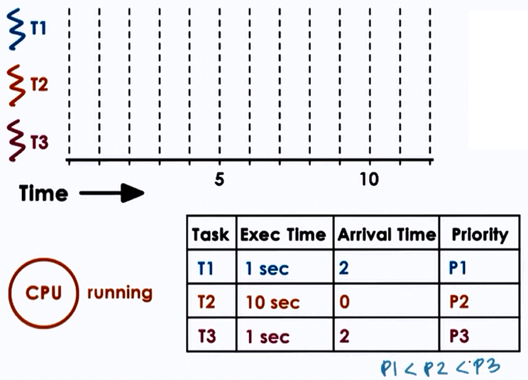
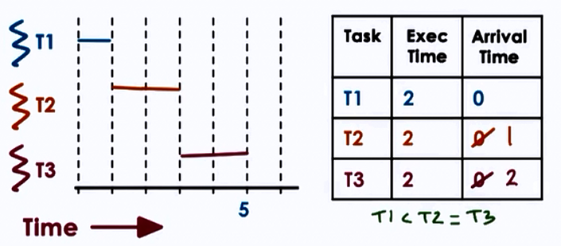
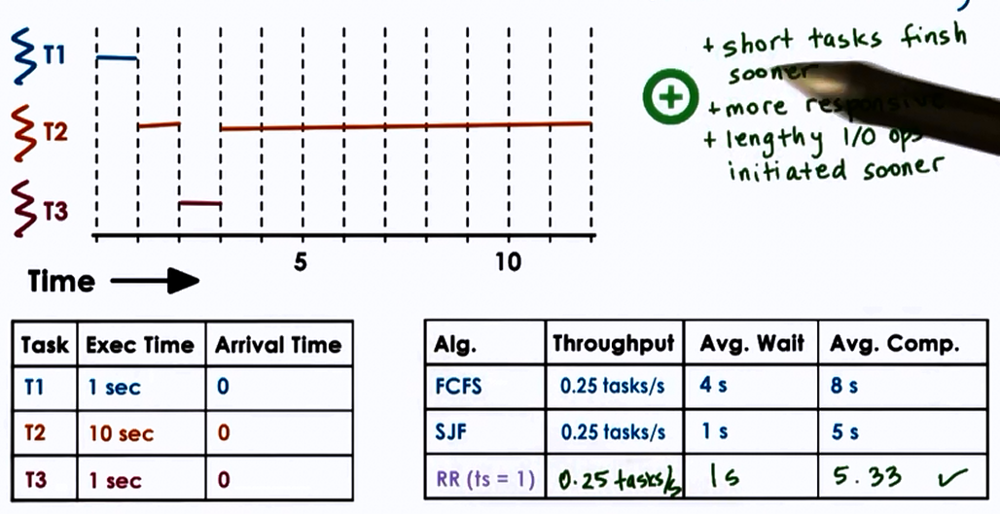

# Scheduling

Operating System perform scheduling in the following simple ways:

- Dispatch orders immediately
	- scheduling is simple FIFO (First-Come-First-Serve)
- Dispatch simple orders first
	- maximize number of orders processed over time
    - maximize throughput (SJF)
- Dispatch complex orders first
	- maximize utilization of CPU, devices, memory
    
## CPU Scheduler

- Decides how and when process (and their threads) access shared CPUs
- Schedules tasks running at user level processes/threads as well as kernel level threads
- Chooses one of the ready tasks to run on CPU
- Runs when
	- CPU becomes idle
    - new task becomes ready
    - timeslice expired timeout

Context switch, enter user mode, set PC and go! <= Thread is dispatched on CPU.

* Which task should be selected?
	- Scheduling policy/algorithm
* How is this done?
	- Depends on runqueue data structure
    
### "Run-to-completion" Scheduling

- Initial assumptions
	- group of tasks/jobs
    - known execution time
    - no preemption
    - single CPU
- Metrics
	- throughput
    - average job completion time
	- average job wait time
	- CPU utilization
    
## Scheduling algorithms:

### 1. First Come First Serve (FCFS)

* Schedules tasks in order of arrival

```
runqueue = queue(FIFO)
``` 

If T1, T2, T3 arrive in the given order and T1 has execution time 1s, T2 10s and T3 1s then :

* Throughput = 3/(1+10+1) = 3/12 = 0.25s
* Average completion time = (1 + 11 + 12)/3 = 8s
* Average wait time = (1+1+11)/3 = 4s
* Starvation NOT possible

### 2. Shortest Job First (SJF)

* Schedules tasks in order of execution time
* Therefore for the above example, T1(1s) > T3(1s) > T2(10s)
* Starvation possible

```
runqueue = ordered(queue)

//or

runqueue = tree()
```

For SJF,

* Throughput = 3/(1+10+1) = 3/12 = 0.25s
* Average completion time = (1 + 2 + 12)/3 = 5s
* Average wait time = (0+1+2)/3 = 1s

### Preemptive Scheduling

* SJF + Preemption
* Starvation is possible

T2 arrives first.


### Priority Scheduling

* Tasks have different priority levels
* Run highest priority task next (preemption)
* Starvation is possible



```
runqueue = per priority_queue()

//or 

runqueue = tree() ordered on priority
```

* low priority task stuck in runqueue => starvation
* "priority aging" 
	- priority = f(actual priority, time spent in runqueue)
    - eventually tasks will run
    - prevents starvation
    
### 3. Round-Robin Scheduling

* Pick up the first task from queue (like FCFS)
* Task may yield to wait on I/O (unlike FCFCS)
* Starvation is NOT possible





### 4. Shortest Remaining Time First (SRTF)

* Chooses the process with the shortest CPU burst remaining and executes that one. If processes come in during execution that have less remaining time, the current one is preempted and the new one executed. Therefore, it can lead to starvation.

#### Timeslicing

* Timeslice = max amount of uninterrupted time given to a task
* task may run less than timeslice
	- has to wait on I/O sync
    	- will be placed on queue
	- higher priority task becomes runnable
* using timeslice tasks are interleaved
	- timesharing the CPU
    - CPU bound tasks => preemption after timeslice
    
    

**Advantages**<br>

* Short tasks finish sooner
* More responsive
* Lengthy I/O operations initiated sooner
	- best to keep timeslice > context-switch-time
    
**Disdvantages**<br>    

* Overheads

#### How long should a timeslice be be?

* should balance benefits and overheads

### For CPU bound tasks: 

    

* Hence, for CPU bound tasks, larger timeslice values are better

### For I/O bound tasks: 

    

* Hence, for I/O bound tasks, smaller timeslice values are better
	- Keeps CPU and I/P devices busy, I/O bound tasks run quickly, makes I/O requests responds to a user.
    
### Summary

* CPU bound tasks prefer longer timeslices
	- limits context switching overheads
    - keeps CPU utilization and throughput
    
* I/O bound tasks prefer smaller timeslices 
	- However, if all the tasks in contention are I/O bound, it may not make such a difference
    - If a portion of them are I/O smaller timeslices keeps CPU and device utilization high
    - Provides better user-perceived performance

<hr>
