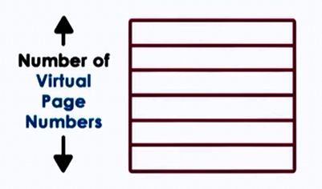
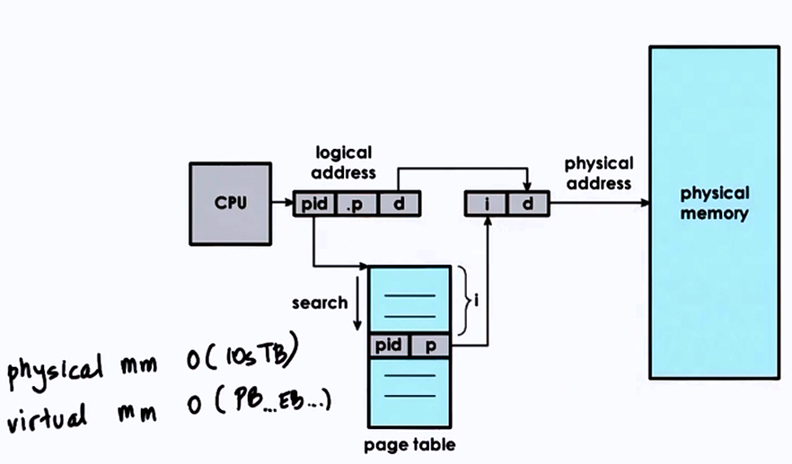
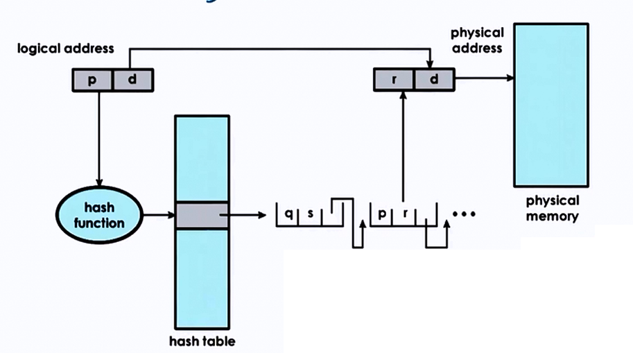

# Memory Management

Operating systems:

- uses intelligently size containers
	- memory pages of segments
- Not all parts are needed at once 
	- tasks operate on subset of memory
- Optimized for performance
	- reduce time to access state in memory
    	- leads to better performance!
        
## Memory Management Goals

#### Virtual vs Physical memory

- Allocate 
	- allocation, replacement
- Arbitrate
	- address translation and validation
    
#### Page-based Memory Management    

- Allocate => pages => page frames
- Arbitrate => page tables

#### Segment-based Memory Management    

- Allocate => segments
- Arbitrate => segment registers

## Hardware Support 

### Memory Management Unit (MMU)  

* translate virtual to physical address 
* reports faults (illegal access, permission, not present in memory)

### Registers

* pointers to page tables
* base and limit size, number of segments

### Cache 

* Translation lookaside buffer
* Valid VA-PA translations using TLB

### Translation

* Actual PA generation done in hardware

## Page Tables

- OS creates page table per process
- On context switch, switch to valid page table
- Updates register that points to correct page table.
	E.g CR3 on x86 architecture
    
## Page Table Entry (PTE)     

#### Flags

* Present (valid/invalid)
* Dirty (written to)
* Accessed (for read or write)
* Protection bits => RWX

## Page Table Entry on x86   

#### Flags

* Present 
* Dirty 
* Accessed
* R/W permission bit 0: R only, 1: R/W
* U/S permission bit 0: usermode, 1: superviser mode only
* others: caching related info (write through, caching disabled)
* unused: for future use

## Page faults

## Page Table Size

* 32 bit architecture
	- Page Table Entry (PTE) = 4 Bytes, including PFN + flags
	- Virtual Page Number (VPN) = 2^32/page_size
    - Page size = 4KB (...8KB, 2MB, 4MB, 1GB)
    
Therefore Page Table Size = (2^32 * 2^12)*4B = 4MB (per process)

* for 64 bit architecture
	- Page Table Entry (PTE) = 8 Bytes
    - Page size = 4KB
    
Page Table Size = (2^64 * 2^12)*8B = 32PB (per process!)

* processes don't use entire address space
* even on 32 bit architecture, it will not always use all 4GB

But Page Table assumes an entry per VPN regardless, of whether corresponding virtual memory is needed or not.

## Hierarchical Page Tables

On malloc, a new internal page table may be allocated.

#### Address split:

<table>
  <tr>
    <th colspan="2">Page Number</th>
    <th>offset</th>
  </tr>
  <tr>
    <td>P1</td>
    <td>P2</td>
    <td>d</td>
  </tr>
  <tr>
    <td>12</td>
    <td>10</td>
    <td>10</td>
  </tr>
</table>

* inner table addresses => 2^10 * page_size = 2^10*2^10 = 1MB
* don't need an inner table for each 1MB virtual memory gap

Additional Layers

* page table directory pointer (3rd level)
* page table directory map (4th level)

- Important on 64 bit architectures
- larger and more sparse => larger gaps would save more internal page table components

### Tradeoffs of Multilevel Page Tables

**Advantages** 

* Smaller internal page tables/directories 
* Granularity of coverage
	- Potentially reduced page table size

**Disadvantages** 

* More memory accesses required for translation
* increased translation latency

## Overheads of Address Translation

For each memory reference :

Single level page table|Four level page table
---------|-----------
x1 access to PTE|x4 accesses to PTE
x1 access to mem|x1 access to mem

which results in slowdown.

## Page Table Cache

#### Translation Lookaside Buffer

- MMU level address translation cache
- On TLB miss => page table access from memory
- has protection/validity bits
- small number of cached address => high TLB hit rate
	- temporal and spatial locality

* Example
	- x86 Core i7
    	- per core : 64-entry data TLB   128-entry instruction TLB 
        - 512-entry shared second-level TLB 

### Inverted Page Tables

### Hashing Page Tables

## Segmentation

Segmentation is the process of mapping virtual to physical memory using segments.

* Segments: arbitrary granularity (size)
	- e.g. code, heap, data, stack..
    - address = segment - selector + offset
* Segment
	- contiguous physical memory
    - segment size = segment base + limit registers

#### Segmentation + Paging

## Page Size

* 10 bit offset => 1 KB page size [2^10]
* 12 bit offset => 4 KB page size [2^12]

In real world examples,

* Linux/x86 : 4 KB, 2MB, 1GB
* Solaris/Sparse: 8kB, 4MB, 2GB

||Large|Huge|
|----|-----|
|page size|2 MB|1 GB|
|offset bits|21 bits|30 bits|
|reduction factor on page table size|x512|x1024|

**Advantages** 

* larger pages
	- fewer page table entries, smaller page tables, more TLB hits
    
**Disadvantages** 

* internal fragmentation => wastes memory

## Memory Allocation

* Memory allocator
	- determines VA to PA mapping
    - address translation, page tables
    	=> simply determine PA from VA and check validity/permsissions 
        
* Kernel Level Allocators
	- kernel state, static process state
* User Level Allocators
	- dynamic process state (heap), malloc/free
    - e.g. d/malloc, jemalloc, Hoard, tcmalloc
    
## Demand Paging

* Virtual Memory >> Physical Memory
	- virtual memory page is not always in physical memory
    - physical page frame saved and restored to/from secondary storage
    
### Demand paging:

- pages swapped in/out of memory & a swap partition (e.g. on a disk)
    

* Original PA != PA after swapping
	- if page is "pinned", swapping is disabled
    
#### When pages should be swapped?

- page(out) daemon
- when memory usage is above threshold
- when CPU usage is below threshold

#### Which page should be swapped out?

- pages that won't be used
- history based prediction
	- Least Recently Used (LRU policy). Access bit tracks if page is referenced.
- page that don't need to be written out
	- Dirty bit to track if modified
- avoid non-swappable pages    
    
## Checkpointing

* Failure and Recovery management technique
	- periodically save process state
    - failure may be unavoidable but can restart from checkpoint, so recovery would be faster

#### Simple Approach

- pause and save
    
#### Better Approach

- write-protect and copy everything at once 
- copy diffs of dirties pages for incremental checkpoints
	- rebuild from multiple diffs, or in background

Checkpointing can also be used in other services:

* Debugging
	- Rewind-Replay
    - rewind = restart from checkpoint 
    - gradually go back to earlier checkpoints until error is found

* Migration
  - continue on another machine
  - disaster recovery
  - consolidation
  - repeated checkpoints in a fast loop until pause and copy becomes acceptable (or unavoidable)

