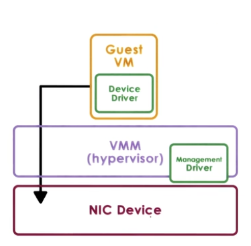
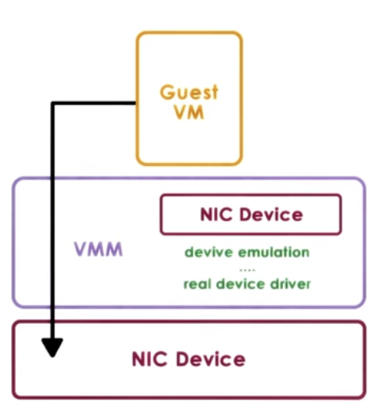

# Virtualization

Virtualization allows concurrent execution of multiple OSs and their applications on the same physical machine.

* Virtual resources : each OS thinks that ot "owns" hardware resources
* Virtual machine (VM) : OS + applications + virtual resources (guest domain)
* Virtualization layer : management of physical hardware (virtual machine monitor, hypervisor)

## Defining Virtual Machine

A Virtual Machine is an efficient, isolated duplicate of the real machine.

* Supported by a Virtual Machine Monitor (VMM):
	1. provides environment essentially identical with the original machine
    2. programs show only minor decrease in speed at worst
    3. VMM is in complete control of the system resources
    
## VMM goals  

* Fidelity
* Performance
* Safety and Isolation

## Virtualization advantages

* consolidation
	- decrease cost, improve manageability
* migration
	- availibility, reliability
* security, debugging, support for legacy OS

## Two main Virtualization Models:

### 1. Bare-metal or Hypervisor based (Type 1)

* VMM (hypervisor) manages all hardware resources abd supports execution of VMs
* privileged, secure VM to deal with devices (and other configuration and management tasks)
* Adopted by Xen(Opensource or Citriol Xen Server) and ESX (VMware)

### 1. Hosted (Type 2)

* Host owns all hardware
* Special VMM modle provides hardware interfaces to VMs and deals with VM context switching

## Virtualization requirements

* Present virtual platform interface to VMs
	- virtualize CPU, memory, devices
* Provide isolation across VMs
	- preemption, MMU for address translation and validation
* Protect guest OS from applications
	- can't run guest OS and applications at same protection level
* Protect VMs from guest OS
	- can't run guest OS and VMMs at same protection level

## Hardware protection levels

Commodity hardware has more than two protection levels

* x86 has 4 protection levels (rings)
	- ring 3 : lowest privilege (applications)
    - ring 1 : OS
    - ring 0 : highest privilege (hypervisor)
* and 2 protection modes
	- non root : VMs 
    	- ring 3 : apps
        - ring 0 : OS
	- root : 
    	- ring 0 : hypervisor

## Process Virtualization (Trap-and-Emulate)

- Guest instruments
	- executed directly by hardware
    - for non-privileged operations : hardware speeds => efficiency
    - for privileged operations : trap to hypervisor
- Hypervisor determines what needs to be done:
	- if illegal operation : terminate VM
    - if legal operation : emulate the behaviour the guest OS was expecting from the hardware
    
## Problems with Trap-and-Emulate

- 17 privileged information do not trao but fail silently
- Hypervisor doesn't know, so it doesn't try to change settings
- OS doesn't know, so assumes change was successful

## Binary Translation

**Goal** : Full Virtualization i.e. guest OS is not modified

**Approach** : Dynamic Binary Translation

1. Inspect code blocks to be executed
2. If needed, translate to alternate instruction sequence
	- e.g. to emulate desired behaviour, possibly avoid traps
3. Otherwise run at hardware speeds
	- cache translated blocks to ammortize translation costs

## Paravirtualization

**Goal** : Performance; give up on modified guest OSs

**Approach** : Paravirtualization : modify guest OSs so that 

- it knows it is running virtualized
- it makes explicit calls to hyperisor (hypercalls)
- hypercalls (~ system calls)
	- package context information
    - specify desired hypercall
    - trap to VMM
- Xen : opensource hypervisor

## Memory virtualization

* Full virtualization
	- all guests expect contiguous physical memory starting at 0
    - virtual vs physical vs machine addresses and page frame numbers
	- still leverages hardware (MMU, TLB..)    
* Option 1
	- guest page table : VA => PA
    - hypervisor : PA => MA
    - too expensive!
* Option 2
	- guest page tables : VA => PA
    - hypervisor shadow PT : VA => MA
    - hypervisor maintains consistence
    	- e.g. invalidate on context switch, write protect guest PT to track new mappings
* Paravirtualized 
	- guest aware of virtualization
    - no longer strict requirement on contiguous physical memory starting at 0
    - explicitly registers page tables with hypervisor
    - can "batch" page tables updates to reduce VM exits
    - other optimazations
    
Overheads eliminated or reduced on newer platforms

## Device Virtualization

* For CPUs and Memory
	- less diversity, Intruction-Set-Architecture(ISA) level
    - Standardization of interface
* For Devices
	- high diversity
    - lack of standard specification of device interface and behaviour

#### 3 key models for Device Virtualization:

### 1. Pass through model

Approach: VMM-level-driver configures device access permissions

**Advantages** 

* VM provided with exclusive and direct (VMM bypass) access to the device

**Disadvantages** 

* Device sharing difficult
* VMM must have exact type of device as what VM expects
* VM migration tricky
    
### 2. Hypervisor - Direct model

Approach: 

- VMM interrupts all device accesses
- Emulate device operations
	- translate to generic I/O operations
    - traverse VMM-resident I/O stack
    - invoke VMM-resident driver
    
    

**Advantages** 

* VM decoupled from physical device
* Sharing, migration, dealing with device specifics

**Disadvantages** 

* Latency of device operations
* Device driver ecosystem complexities in Hypervisor

### 3. Split Device-Driver model

Approach: 

- Device access control split between
- Emulate device operations
	- front-end driver in guest VM (device API)
    - back-end driver in service VM (or Host)
    - modified guest drivers
    	- i.e. limited to paravirtualized guests

          

**Advantages** 

* Eliminate emulation overhead
* Allow for better management of shared devices

