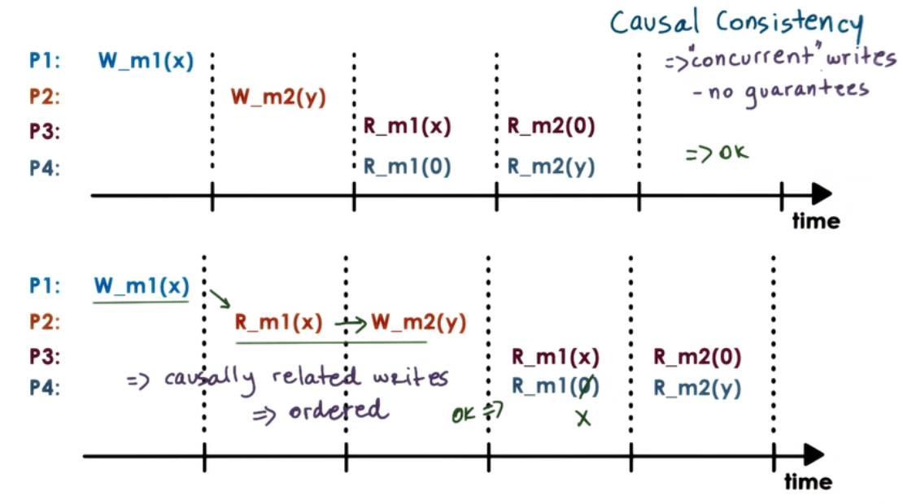

# Distributed Shared Memory 

- Must decide placement
	- place memory (pages) close to relevant processes
- Must decide migration
	- when to copy memory (pages) from remote to local
- Must decide sharing rules
	- ensure memory generations are properly ordered
    
## "Peer" Distribution Applications

* Each node 
	- "owns" state
    - provide service
- all nodes are "peers".

Examples: Big-data analytics, web searches, context sharing or distributed shared memory (DSM)

## Distributed Shared Memory (DSM)

DSM is a service that manages memory accross multiple nodes so that applications that are running on top will have an illusion that they are running on a shared memory.

* Each node 
	- "owns" state => memory
    - provide service
    	- memory read/writes from any nodes
        - consistency protocols
	- permits scaling beyond single machine memory limits
    	- more "shared" memory at lower cost 
        - slower overall memory access
        - commodity interconnect technologies support this RDMA(Remote Direct Memory Access)

## Hardware vs Software DSM

* Hardware-supported (expensive!)
	- relies on interconnect
    - OS manages larger physical memory 
    - NIC(Network Interface Cards) translate remote memory accesses to messages
    - NICs involved in all aspects of memory management; support atomics..
* Software supported
	- everything done by software
    - OS,or language runtime
*  Hybrid (Software tasks in Hardware) DSM implementations
    - prefetch pages
    - address translation (easier done in hardware)
    - triggering invalidations (easier done in hardware)

## DSM Design : Sharing Granularity

* cache line granularity?
	- overheads too high for DSM
- variable granularity [N]
- page granularity [Y] (OS level)
- object granularity [Y] (Language runtime)
	- beware of false sharing E.g. x and y shared on same page
    
## What types of applications use DSM?

Application access algorithm
- Single reader/ single writer (SRSW)
- Multiple readers/ single writer (MRSW)
- Multiple reader/ Multiple writers (MRMW)

## Performance considerations

* DSM performance metric == access latency
* Achieving low latency through 
	- Migration
    	- makes sense for SRSW
        - requires data movement
	- Replication (caching)        
    	- more general 
        - requires consistency management
* Hence, migration is okay for SRSW but not for all. 
* Caching and Replication        
	- Copies of data to incerease data access
    - for many concurrent writes, overheads too high but stil generally better than Migration
    
## Consistency Management

* In SMP
	- write invalidate
    - write update 
* coherence operations triggered in each write 
	- overhead too high
* Push invalidations when data is written to 
	1. Proactive
    2. Eager
    3. Pessimistic
* Pull modifications information periodically
	1. on demand (reactive)
    2. lazy
	3. optimistic
* when these methods get triggered depends on the consistency model for the shared state

## DSM architecture (page-based, OS-supported)

* Page-based DSM architecture
	- distributed nodes, each with own local memory contribution
    - pool of pages from all nodes
    - each page has IO ("home" node), page frame number
* if MRMW 
	- need local caches for performances (latency)
    - "home" or "manager" node drives coherence operations
    - all nodes responsible for part if distributed memory (state) management
* Home node    
    - keeps state: page accessed, modifications, caching enabled/disabled, locked..
* Current owner
	- owner may not be equal to home node
* Explicit replicas 
	- for load balancing, performance, or reliability
    	home, manager node controls memory
        

## DSM metadata

## Implementing DSMs

* Problem : DSM must intercept access to DSM state 
	- to send remote messages requesting access
    - to trigger coherence messages
- overheads should be avoided for local non-shared state (pages)
- dynamically engage and disengage DSM when necessary
* Solution : Use hardware MMU support!
	- trap in OS if mapping invalid or access denied
	- remote address mapping -> trap and pass to DSM to send message
	- cached content -> trap and pass to DSM to perform memory coherence operations
	- other MMU information useful (e.g. Dirty page)  
    
## Consistency model

- Agreement between memory (state) and upper software layers
- Memory behaves correctly if and only if software follows specific rules
- Memory (state) guarantees to behave correctly
	- access ordering
    - propagation/ visibility of updates
    
### Our notation    
   

* R_m1(X) => X was read from memory location m1
* W_m1(Y) => Y was written to memory location m1

### Strict Consistency

Strict Consistency => updates visible everywhere immediately

- In practice
	- Even on single SMP no guarantees on order without extra locking and synchronization
    - in DS, latency and message reorder make this even harder
    - Hence almost impossible to guarantee strict consistency

### Sequential Consistency

Sequential consistency =>

* memory updates from different  processors may be arbitrarily interleaved
* All processes will see the same interleaving
* Operations from the same process always appearin order they were issued

### Causal Consistency

* For writes not causally related, "concurrent" writes doesnt gurantee.
* Don't permit arbitrary ordering from same process writer

### Weak Consistency

* Use of synchronization
	- Synchronization point => operations that are available (R,W,Sync)
    - all updates prior to a sync point will be visible
    - no guarantee what happens in between
    
**\+** limit data movement of coherence operations

**\-** maintain extra state for additional operations

* Variations:
	- Single sync operation (sync)
    - Seperate sync per surface of state (page)
    - Seperate "entry/acquire" vs "exit/release" operations

