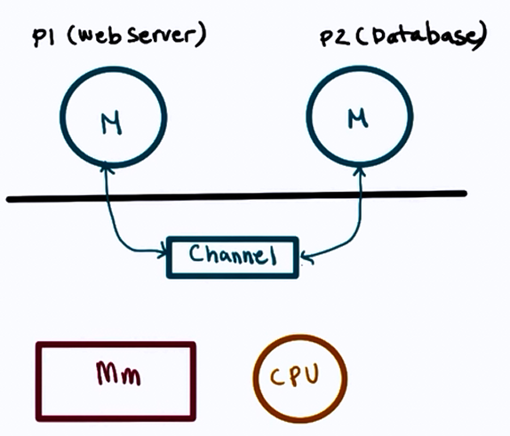

# Process and Process Management

**Process**: Instance of an executing program.

- State of execution
	- program counter, stack pointer
- Parts and temporary holding area
	- data, register state, occupies state in memory
- May require special hardware
	- I/O devices
    
Process is a state of a program when executing and loaded in memory (active state) as opposed to application (static state).

## What does a process look like?

### Type of state

- Text and Data
	- static state when process loads first
- Heap 
	- dynamically created during execution
- Stack
	- grows and shrinks 
    - LIFO queue (used to store task checkpoints to resume the original process after switching from another.)
    
## How does the OS know what a process is doing?

Using:

* Program counter
* CPU registers
* Stack pointer

## Process Control Block (PCB)

* PCB created when process is created
* Certain fields are updated when process state change e.g. memory mapping
* or other fields that change very frequently e.g. Program Counter

## How is PCB used ?

## Context Switch

* Mechanism used to switch from the context of one process to another in the CPU.

- They are expensive!
	- direct costs: no of cycles for load and store instructions.
    - indirect costs: **COLD** cache (read more [here](http://stackoverflow.com/questions/22756092/what-does-it-mean-by-cold-cache-and-warm-cache-concept))
		- Therefore limit frequency how context switching is done.

When a cache is **HOT**, most process data is in the cache so the process performance will be at its best.

Sometimes there are situations where we have to Context Switch (higher priority process, timesharing, etc.)

## Process Lifecycle

CPU is able to execute a process when the process is in Running or Ready state.

## Process Creation

#### Mechanisms:

- fork :
	- copies the parent PCB into new child PCB
    - child contains execution at instruction after fork
    
- exec :
	- replace child image
    - load new program and start from first instruction
   
## What is the role of CPU scheduler?

CPU scheduler determines which one of the currently ready processes will be dispatched to the CPU to start running, and how long it should run for.

OS must :

* preempt => interrupt and save current context
* schedule => run scheduler to choose next process
* dispatch => dispatch process 2 switch into its context

## Scheduling design decisions

* What are the appropriate timeslice values?
* Metrics to choose next process to run?

## I/O

A process can make way in the ready queue in a number of ways.

## Can process interact?

#### Inter Process communication:

IPC mechanisms:

- transfer data/info between address space
- maintain protection and isolation
- provide flexibility and performance

Two types of IPC models:

####  1. **Message Passing IPC**

* OS provides communication channel line shared buffer
* Processes can write(send), read(receive) msg to/from channel

**Advantages**: OS manages the channel 
**Disadvantages**: Overheads
    
#### 2. **Shared Memory IPC**

* OS establishes a shared channel and maps it into each processes' address space
* Processes directly write(send), read(receive) msg to/from this memory

**Advantages**: OS is out of the way after establishing the shared channel 
**Disadvantages**: Re-implementing a lot of code that could have been done by the OS

Overall, **shared memory** based communication is better if mapping memory between two processes is ammortized over a large number of messages.

