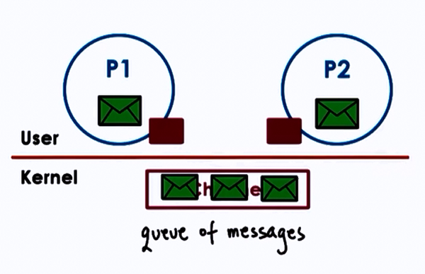

# Inter Process Communication

- Processes share memory
	- data in shared messages
- Processes exchange messages
	- message passing via sockets
- Requires synchronization
	- mutex, waiting
    
**Inter Process Communication**(IPC) is an OS supported mechanism for interaction among processes (coordination and communication)   

- Message Passing
	- e.g. sockets, pips, msgs, queues
- Memory based IPC 
	- shared memory, memory mapped files
- Higher level semantics
	- files, [RPC](10-Remote-Procedure-Calls.md)
- Synchronization primitives

## Message Passing

* Send/Receive messages 
* OS creates and maintains a channel
	- buffer, FIFO queue
* OS provides interfaces to processes
	- a port
    - processes send/write messages to this port
    - processes receive/read messages from this port

* Kernel required to 
	- establish communication
    - perform each IPC operation
    - send: system call + data copy
    - receive: system call + data copy
* Request-response:
	4x user/ kernel crossings +  
    4x data copies
    
**Advantages**  

* simplicity : kernel does channel management and synchronization

**Disadvantages**  

* Overheads 

### Forms of Message Passing IPC

#### 1. Pipes 

- Carry byte stream between 2 process
- e.g connect output from 1 process to input of another
    
    

#### 2. Message queues

- Carry "messages" among processes
- OS management includes priorities, scheduling of message delivery 
- APIs : Sys-V and POSIX
    
        

#### 3. Sockets

- send() and recv() : pass message buffers
- socket() : create kernel level socket buffer
- associated neccessary kernel processing (TCP-IP,..)
- If different machines, channel between processes and network devices
- If same machine, bypass full protocol stack
    
        

## Shared Memory IPC

* read and write to shared memory region
* OS establishes shared channel between the processes
	1. physical pages mapped into virtual address space
    2. VA(P1) and VA(P2) map to same physical address
    3. VA(P1) != VA(P2)
    4. physical mempry doesn't need to be contiguous
* APIs : SysV, POSIX, memory mapped files, Android ashmem   

**Advantages** 

* System calls only for setup data copies potentially reduced (but not eliminated)

**Disdvantages** 

* explicit synchronization
* communication protocol, shared buffer management
    - programmer's responsibility
    
## Which is better?

**Overheads for**
1. Message Passing : must perform multiple copies
2. Shared Memory : must establish all mappings among processes' address space and shared memory pages

Thus, it depends.

## Copy vs Map

Goal for both is to transfer data from one into target saddress space

Copy (Message Passing) | Map (Shared Memory)
----------------|-----------------
CPU cycles to copy data to/from port | CPU cycles to map memory into address space
|CPU to copy data to channel
|If channel setup once, use many times (good payoff)
|Can perform well for 1 time use

* Large Data: t(Copy) >> t(Map)
	- e.g. tradeoff exercised in Window "Local" Procedure Calls (LPC)
    
## Shared Memory and Synchronization

Use threads accessing shared state in a single addressing space, but for process

Synchronization method:

1. mechanism supported by processing threading library (pthreads)
2. OS supported IPC for sync

Either method must coordinate

* no of concurrent access to shared segment
* when data is available and ready for consumption

### IPC Synchronization

Message Queues| Semaphores
-------------|-------------
Implement "mutual exclusion" via send/receive | OS supported synchronization construct
|binary construct (either allow process or not)
|Like mutex, if value = 0, stop; if value = 1, decrement(lock) and proceed

